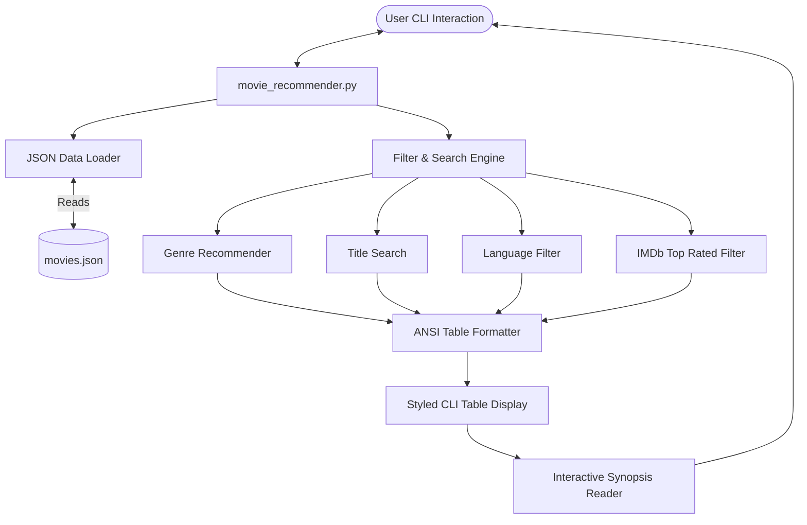

# Movie Recommendation System

<p align="center">
  
  
  
  
</p>

An interactive, user-friendly command-line Movie Recommendation System written in Python. This project is pre-loaded with a rich, curated dataset of highly acclaimed Indian movies across Bollywood (Hindi), Kollywood (Tamil), Tollywood (Telugu), Mollywood (Malayalam), and Sandalwood (Kannada).

---

## 🏗️ Architecture

The system follows a clean, decoupled database-logic architecture to keep dataset updates separated from code logic.



---

## 🚀 Features

- **📂 Decoupled Database**: The movie dataset is separated into a structured JSON file (`movies.json`), making it incredibly easy to edit, extend, or update without changing the application logic.
- **🎨 Stylized CLI Interface**: Utilizes ANSI color codes for a premium, clean command-line visual experience.
- **🔍 Multiple Search & Recommendation Modes**:
  - **Recommend by Genre**: Dynamically extracts available genres from the database and recommends matching movies (sorted by rating).
  - **Search by Title**: Performs a case-insensitive text search to find movies by name.
  - **Filter by Language**: Allows filtering of movies by languages (Hindi, Tamil, Telugu, Malayalam, Kannada).
  - **View Top Rated Movies**: Lists the highest-rated movies with a customizable display count.
- **🍿 Interactive Synopsis Inspector**: Allows users to select any recommended movie from the table and read its director, rating, genres, and a brief synopsis.

---

## 📂 Project Structure

```text
Movie Recommendation System/
│
├── movies.json            # Curated movie database (JSON format)
├── movie_recommender.py   # Main Python CLI interactive application script
├── .gitignore             # Standard Python gitignore rules
└── README.md              # Project documentation (this file)
```

---

## 🛠️ Installation & Getting Started

### Prerequisites

- **Python 3.x** installed on your system. No external libraries are required (uses Python standard libraries only).

### Running the Application

1. **Clone or Download** the repository to your local machine:
   ```bash
   git clone https://github.com/dhanish0711/Movie-Recommendation-System.git
   cd "Movie Recommendation System"
   ```

2. **Run the script**:
   ```bash
   python movie_recommender.py
   ```

---

## 📝 Example Output

### Main Menu
```text
===================================================
          🎥  MOVIE RECOMMENDATION SYSTEM  🎥          
===================================================
Explore & find the best Indian movies across genres!

Main Menu:
  1. 🎭 Recommend by Genre
  2. 🔎 Search by Title
  3. 🌍 Filter by Language
  4. ⭐ View Top Rated Movies
  5. ❌ Exit

Enter choice (1-5):
```

### Genre Recommendations Table
```text
🎉 Recommendations for Genre: 'Comedy' (4 found)

+-------------------+------+----------+------+--------------------+-----------------------------+
| Title             | Year | Language | IMDb | Director           | Genres                      |
+-------------------+------+----------+------+--------------------+-----------------------------+
| Kumbalangi Nights | 2019 | Malayalam| 8.5  | Madhu C. Narayanan | Comedy, Drama, Romance      |
| 3 Idiots          | 2009 | Hindi    | 8.4  | Rajkumar Hirani    | Comedy, Drama               |
| Premam            | 2015 | Malayalam| 8.3  | Alphonse Puthren   | Comedy, Drama, Romance      |
| Andhadhun         | 2018 | Hindi    | 8.2  | Sriram Raghavan    | Comedy, Crime, Thriller     |
+-------------------+------+----------+------+--------------------+-----------------------------+
```

### Interactive Synopsis Inspector
```text
Would you like to read the synopsis of any movie listed? (Enter Title or press Enter to skip): 3 idiots

🍿 3 Idiots (2009) - Hindi
Director: Rajkumar Hirani
IMDb Rating: ⭐ 8.4/10
Genres: Comedy, Drama
Synopsis: Two friends are searching for their long lost companion. They revisit their college days and recall the memories of their friend who inspired them to think differently.
```

---

## 🔧 Future Enhancements

- Add user rating capability that saves ratings back to the database.
- Integrate with an online movie API (like TMDB or OMDb) to fetch real-time metadata and posters.
- Build a lightweight web interface using Flask or Streamlit.

---

<p align="center">
  Made with ❤️ by <a href="https://github.com/dhanish0711/">Dhanish Ladwani</a>
</p>
